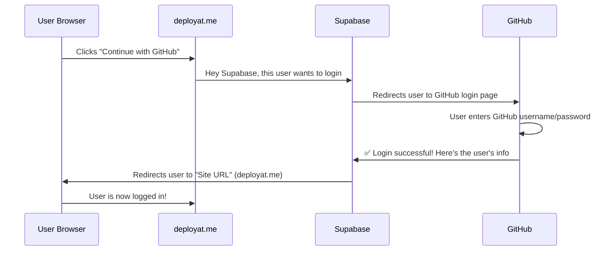
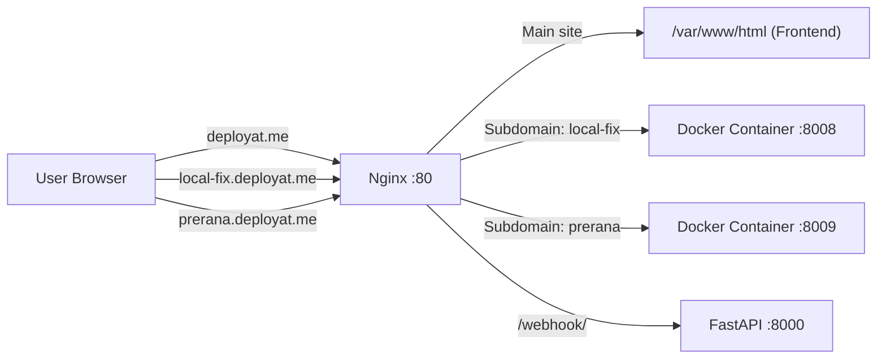

# Deployly — Core Concepts Explained

## 1. Supabase URLs (Site URL & Redirect URL)

### The Problem
When a user clicks "Continue with GitHub", they leave YOUR website and go to GitHub's website to log in. After login, GitHub needs to know **where to send the user back**. That's what these URLs control.

### The Full Login Flow



### What each URL does

**Site URL** = Where Supabase sends the user AFTER successful login
```
Site URL = http://deployat.me
```
When login is done → Supabase tells the browser: "Go to http://deployat.me"

**Redirect URL** = Which URLs are ALLOWED as destinations (security whitelist)
```
Redirect URL = http://deployat.me/*
```
This prevents hackers from redirecting users to a fake website after login.

### Why we changed it twice

| When | Site URL | Why |
|------|---------|-----|
| Local development | `http://localhost:5173` | Testing on your laptop |
| First EC2 deploy | `http://16.113.45.135` | No domain yet, used IP |
| After getting domain | `http://deployat.me` | Now we have a real domain |

Each time the "home address" of your app changes, you must tell Supabase the new address. Otherwise, after login, Supabase sends users to the OLD address!

### Simple Analogy
> Think of it like a **courier delivery**. You order something online (login with GitHub). The courier (Supabase) needs your **home address** (Site URL) to deliver the package (logged-in user). If you move to a new house (new domain), you must **update your address** or the package goes to your old house!

---

## 2. Webhooks vs OAuth — What & Why

### OAuth (Login with GitHub)

**What**: A way to let users log into YOUR app using THEIR GitHub account. No need to create a separate username/password for Deployly.

**Why we use it**: 
- Users don't need to create a new account
- We can verify they're real GitHub users
- We can access their GitHub repos
- It's more secure (we never see their password)

**Flow**:
```
User → "Login with GitHub" → GitHub verifies → Sends user back → ✅ Logged in
```

**Real-world analogy**:
> When you visit a building and the guard says "Show your Aadhaar card" instead of creating a new building ID card. Your Aadhaar (GitHub) already proves who you are!

---

### Webhooks (Auto-deploy on push)

**What**: A way for GitHub to **automatically notify** your server when something happens (like a code push).

**Why we use it**: When a user pushes code to GitHub, we want Deployly to **automatically redeploy** their app without them clicking anything.

**Flow**:
```
Developer pushes code to GitHub
         ↓
GitHub sees the push event
         ↓
GitHub sends a POST request to YOUR server
(http://deployat.me:8000/webhook/)
         ↓
Your server receives it → starts rebuilding the app
         ↓
App is redeployed automatically! 🚀
```

**The Webhook Secret**: 
When we set up the webhook, we put a SECRET in both places (GitHub + our `.env`). This is like a **password** between GitHub and our server. When GitHub sends a webhook, it includes this secret so our server can verify: "Yes, this really came from GitHub, not from a hacker."

**Real-world analogy**:
> **OAuth** = Showing your ID card to enter a building (proving who YOU are)
> **Webhook** = The post office automatically delivering mail to your house when someone sends you a letter (GitHub auto-notifying your server)

### Summary Table

| Feature | OAuth | Webhook |
|---------|-------|---------|
| **Direction** | User → GitHub → Your app | GitHub → Your server |
| **Purpose** | Login / Authentication | Auto-deploy on code push |
| **Who triggers it** | The user (clicks login) | GitHub (automatically) |
| **When it happens** | User wants to log in | Code is pushed to repo |
| **Secret/Key** | OAuth Client ID + Secret | Webhook Secret |

---

## 3. .env.example — Security Issue ⚠️

### What happened
The `.env.example` file was pushed to GitHub with **real API keys** inside. This is a security risk because:

1. Anyone can see your GitHub repo
2. They can see your real Supabase keys, Fernet encryption key, etc.
3. They could use your keys to access your database or encrypt/decrypt data

### What .env.example SHOULD look like
```env
# Copy this file to .env and fill in your actual values
SUPABASE_URL=your_supabase_url_here
SUPABASE_KEY=your_supabase_key_here
FERNET_KEY=your_fernet_key_here
GITHUB_WEBHOOK_SECRET=your_webhook_secret_here
```

It should have **placeholder text**, not real values! It's just a TEMPLATE showing what keys are needed.

### What to do now
1. **Delete** `.env.example` from GitHub (or replace with placeholder values)
2. The real `.env` file is in `.gitignore` — so it's NEVER pushed to GitHub ✅
3. The `.env` file stays ONLY on your EC2 server

### The difference

| File | Contains | On GitHub? | On Server? |
|------|----------|-----------|------------|
| `.env` | Real secret keys | ❌ NEVER | ✅ Yes |
| `.env.example` | Fake placeholder values | ✅ Yes (as template) | Optional |
| `.gitignore` | List of files to not push | ✅ Yes | ✅ Yes |

---

## 4. Nginx — The Traffic Controller

### What is Nginx?
Nginx is a **reverse proxy** — it sits in front of your apps and decides where to send each request. Think of it as a **traffic police officer** at a busy intersection.

### Without Nginx (Bad):
```
User visits deployat.me:8000    → FastAPI backend
User visits deployat.me:8008    → Local-Fix app
User visits deployat.me:8009    → Prerana app

❌ Users need to remember port numbers!
```

### With Nginx (Good):
```
User visits deployat.me         → Nginx → serves frontend (dashboard)
User visits local-fix.deployat.me → Nginx → routes to port 8008
User visits prerana.deployat.me   → Nginx → routes to port 8009

✅ Clean URLs, no port numbers!
```

### How Nginx works in Deployly



### Nginx has 3 jobs in Deployly:

**Job 1: Serve the Dashboard**
```
deployat.me → Nginx reads /var/www/html/index.html → Shows the React dashboard
```

**Job 2: Route Subdomains to Containers**
```
local-fix.deployat.me → Nginx checks deploy.conf → Forwards to port 8008
prerana.deployat.me   → Nginx checks deploy.conf → Forwards to port 8009
```

**Job 3: Wake Sleeping Apps**
```
local-fix.deployat.me → Nginx asks FastAPI: "Is this app awake?"
                       → FastAPI: "No, it's sleeping. Let me wake it up..."
                       → Container starts → Nginx forwards the request
```

### The Config Files

| File | Purpose |
|------|---------|
| `/etc/nginx/sites-enabled/deployly` | Main site config (dashboard + API proxy) |
| `/etc/nginx/conf.d/deploy.conf` | Auto-generated! One server block per deployed app |

Every time a new app is deployed, `builder.py` calls `nginx_config.py` which **regenerates** `deploy.conf` with the new app's subdomain and port, then reloads Nginx.

### Real-world analogy
> Nginx is like a **hotel reception desk**. 
> - All guests (requests) come to the same building entrance (port 80)
> - The receptionist (Nginx) checks which room (subdomain) you want
> - Routes you to the correct room (Docker container)
> - If the room guest is sleeping, wakes them up first!
