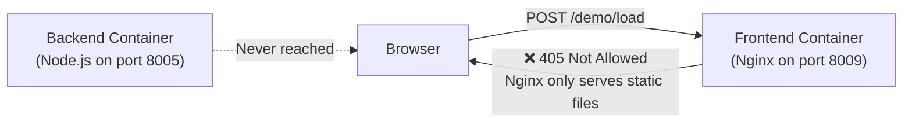
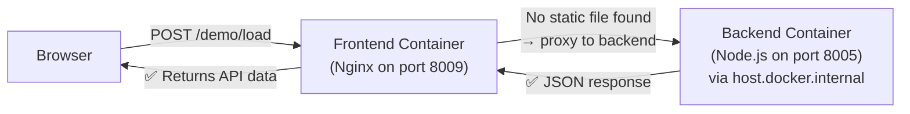

# Fullstack Deployment Fix — Complete Walkthrough

## The Problem
When a user deployed a **fullstack app** (separate frontend + backend) on the Deployly platform, the frontend showed **405 (Not Allowed)** errors. API calls from the frontend never reached the backend.

---

## Root Cause: How It Worked Before (Broken)



**Why it failed:**
1. The frontend was a **Vite SPA** built into static HTML/JS/CSS and served by **Nginx inside a Docker container**
2. In development, Vite's `server.proxy` forwards API calls to the backend — but **this proxy only exists during `npm run dev`**
3. In production (Docker), Nginx serves static files only. When the browser called `POST /demo/load`, Nginx said **"405 — I don't handle POST requests for static files"**
4. The backend was also crashing due to separate issues (Prisma + port mismatch)

---

## How It Works Now (Fixed)



---

## All Bugs Fixed (5 total)

### Bug 1: Backend crashed — Prisma not generated
**File:** [builder.py](file:///d:/Deploy/backend/builder.py) (auto-generated Dockerfile)

The auto-generated Dockerfile for Node.js backends used `node:18-alpine` which lacked OpenSSL (needed by Prisma). Also, `prisma generate` was never run.

**Fix:** Changed to `node:20-slim` (Debian-based, has OpenSSL), auto-detect Prisma in `package.json` and add `RUN npx prisma generate` after `COPY . .`.

---

### Bug 2: Shell `&&` operator broken in start commands
**File:** [builder.py line 409](file:///d:/Deploy/backend/builder.py#L409)

When a user set `start_command = "npx prisma generate && npm run dev"`, Docker SDK split it into array args: `["npx", "prisma", "generate", "&&", "npm", "run", "dev"]` — treating `&&` as a literal argument, not a shell operator.

**Fix:** Wrapped in `sh -c`:
```python
# Before (broken)
run_kwargs["command"] = start_cmd.strip()

# After (fixed)
run_kwargs["command"] = ["sh", "-c", start_cmd.strip()]
```

---

### Bug 3: Frontend Nginx only served static files (the 405 error)
**File:** [builder.py](file:///d:/Deploy/backend/builder.py) (frontend Dockerfile generation)

The generated frontend Dockerfile had a simple Nginx config that could only serve static files. POST/GET API calls to non-file paths returned 405/404.

**Fix:** Created a runtime `entrypoint.sh` that generates Nginx config at container startup. If `VITE_API_URL` env var is set, Nginx proxies non-static requests to the backend:

```
Request flow:
1. Browser: POST /demo/load
2. Nginx: try_files /demo/load → not a static file
3. Nginx: @backend → proxy_pass to VITE_API_URL/demo/load
4. Backend returns JSON → Nginx returns it to browser ✅

SPA routing flow:
1. Browser: GET /capability-gap  
2. Nginx: try_files /capability-gap → not a static file
3. Nginx: @backend → proxy to backend → backend returns 404
4. Nginx: error_page 404 → @spa → serve index.html ✅
```

---

### Bug 4: Docker `localhost` networking
`VITE_API_URL=http://localhost:8005` didn't work because inside a Docker container, `localhost` refers to the container itself, not the host.

**Fix:** Use `http://host.docker.internal:8005` (Docker Desktop's hostname for reaching the host machine).

---

### Bug 5: Show/hide toggle for env vars
**File:** [EnvironmentTab.jsx](file:///d:/Deploy/frontend/src/components/dashboard/EnvironmentTab.jsx)

Added Eye/EyeOff toggle icon on each environment variable value field, using `lucide-react` icons and per-row visibility state.

---

## Why Render/Vercel Don't Have This Problem

| Platform | How they handle fullstack | Your platform (now) |
|---|---|---|
| **Render** | Each service gets a URL; users set env vars pointing to other services | Same — `VITE_API_URL` points to backend |
| **Vercel** | Rewrites/proxies in `vercel.json` route API paths to serverless functions | `entrypoint.sh` configures Nginx proxy at runtime |
| **Railway** | Internal networking between services via `service.railway.internal` | `host.docker.internal` for same-host containers |

Your platform now uses the **same pattern** — the frontend's Nginx acts as a reverse proxy to the backend, configured at runtime via environment variables.
